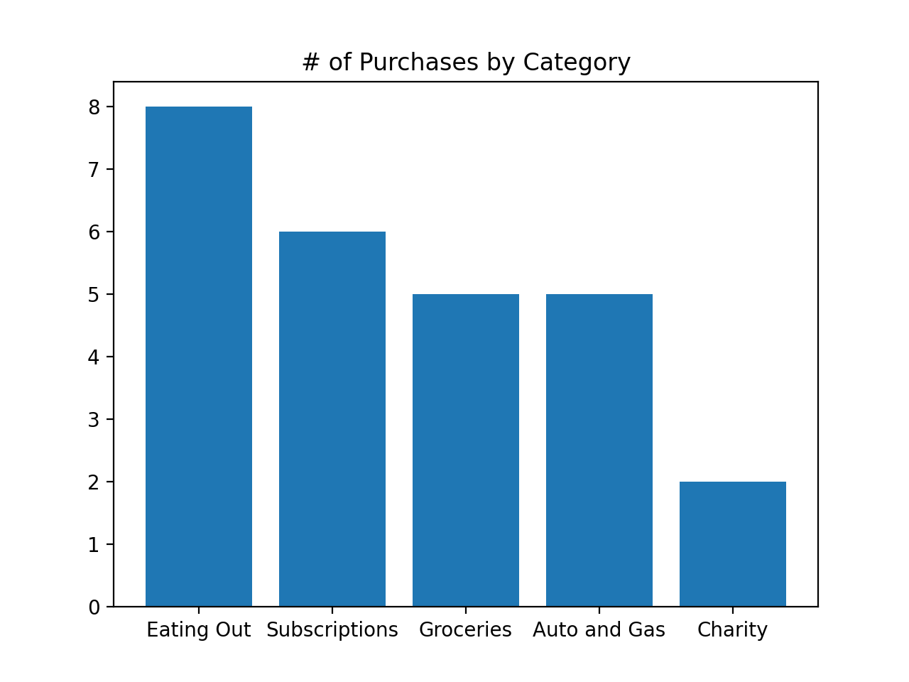
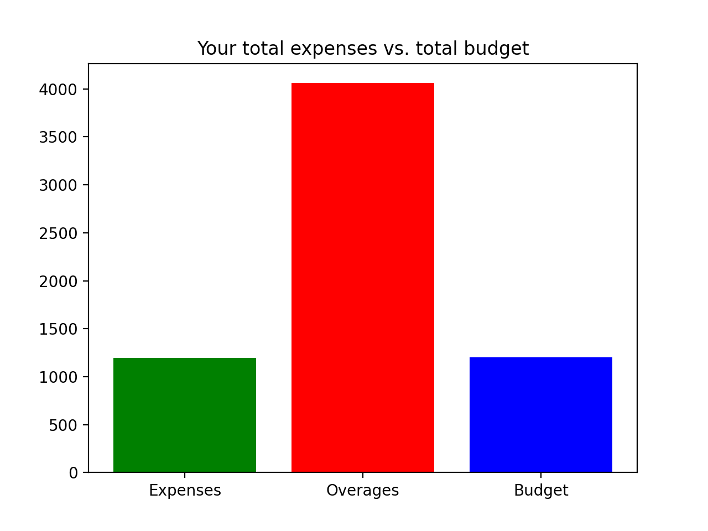
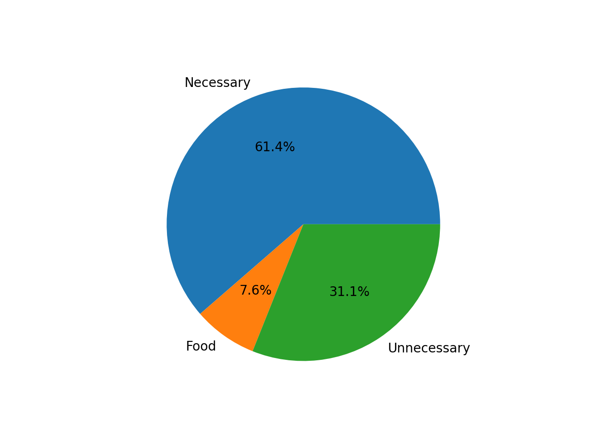

# Setup





1. ### Install python

   Install python3 per your OS instructions.

2. ### Setup a virtual environment with venv

   Create the venv: `python3 -m venv venv`

   Activate the venv: `source venv/bin/activate`

3. ### Install requirements
   Run the following command to install the project’s required libraries:
   `python -m pip install -r requirements.txt`

## Pip

Versions pip updates frequently, but versions greater than 10.x.x should work with this project.

## Tests

In order to verify that everything is setup correctly, run the following command from the project root. `pytest`

## Previewing Your Work

`python -m budget.FrequentExpenses`

## Module 1

### Count Purchases by Category

### Verify module:

    To run tests run: `pytest -k "module1" -s`
    To run the file: `python -m budget.FrequentExpenses`

1. ### Import the Expense Module

   Last month’s spending data is in `data/spending_data.csv`, which is a spreadsheet with 3 columns for - Location, Category, and amount. For example, the first row contains: `Alaska Air,Travel,-$115.75`. We want to analyze our spending habits in a few different ways. In this module, we are going to read in this file and display the categories with the most purchases in a graph.

   To read in the data, we’ll use the classes in the file named Expense.py. There are 2 classes -- Expense (which has a vendor, category, and amount) and Expenses (which has a list of type Expense and a sum of the amounts). Expenses also has a method read_expenses() which we’ll use to read the .csv file.

   To start, open the file named `FrequentExpenses.py` in the `budget` directory, and add `import Expense` to the top of the file.

2. ### Read in the Spending Data

   Create a variable named expenses and set it equal to calling the Expenses() constructor. Then call the read_expenses() method on expenses and pass in the name of the file `data/spending_data.csv`.

3. ### Create a List of the Spending Categories

   Create an empty list called spendingCategories. Then, create a for loop that iterates each Expense in the expenses. Inside the loop, we want to `append()` `expense.category` to `spendingCategories`.

4. ### Count Categories with a Counter Collection

   In order to use the Counter Collection, `import collections` at the top of the file. Then after the for loop, create a new variable called `spendingCounter` and set equal to passing `spendingCategories` to the `collections.Counter()` constructor.

   If you printed the Counter with print(spendingCategories), you would see the following output:
   `Counter({'Eating Out': 8, 'Subscriptions': 6, 'Groceries': 5, 'Auto and Gas': 5, 'Charity': 2, 'Gear and Clothing': 2, 'Phone': 2, 'Travel': 1, 'Classes': 1, 'Freelance': 1, 'Stuff': 1, 'Mortgage': 1, 'Paycheck': 1, 'Home Improvements': 1, 'Parking': 1, 'Utilities': 1})`

   You can see it shows the category as the key and the number of times it was used as the value. With ‘Eating Out` as the most common expense which was done 8 times.

5. ### Get the Top 5 Categories

   We can get only the top 5 most common categories by calling the `most_common()` method on `spendingCounter` and passing in the value `5`. Set the result equal to a variable called `top5`.

6. ### Convert the Dictionary to 2 Lists

   If you’ve used the `zip()` function before it combines 2 iterables (for example, combines two lists into a list of tuples). We can also use `zip(*dictionary_variable)` to separate the keys and values of a dictionary into separate lists. Since we want to have 2 separate lists for the categories and their counts for the bar graph, let’s call `zip(*top5)` and set the result equal to two variables - `categories, count`.

7. ### Plot the Top 5 Most Common Categories

   Add `import matplotlib.pyplot as plt` to the top of the file. Then at the end of the file, call `fig,ax=plt.subplots()` to initialize `fig` as the Figure, or top level container for our graph. And `ax` as the Axes, which contains the actual figure elements.

8. ### Create the bar chart

   Next, call `ax.bar()` with the `categories` and `count` lists as parameters. To add a title, call ax.set_title() and pass in the string '# of Purchases by Category'.

9. ### Display the graph

   Finally, to display the graph, call `plt.show()`.

   The resulting graph should be displayed:

## Module 2

### Create the BudgetList class to Display Overage Expenses

### Verify module:

    To run tests run: `pytest -k "module2" -s`
    To run the file: `python -m budget.BudgetList`

1. ### Create the BudgetList class

   In the `budget` directory, open the `BudgetList.py` file. Inside that file, create a class called `BudgetList` with only `pass` inside the class for now.

2. ### Create the constructor

   Replace `pass` with a constructor that has two parameters - `self, budget`. Then initialize the following class variables:

   - `self.budget` to the passed-in `budget`
   - `self.sum_expenses` to `0`
   - `self.expenses` to an empty list
   - `self.sum_averages` to `0`
   - `self.averages` to an empty list

3. ### Define the append method

   Define an append method that has two parameters - `self` and `item`. Put `pass` inside the method for now.

4. ### Add items to expenses that are under budget

   Replace `pass` with an `if` statement that checks if `self.sum_expenses` plus the passed-in `item` is less than `self.budget`. Inside the `if` block, call `append()` on `self.expenses` and pass in `item`. Also inside the `if` block, add `item` to `self.sum_expenses`.

5. ### Add items to averages that are over budget

   After the `if` block, add an `else` block that calls `append()` on `self.averages` and passes in `item`. Also, increase `self.sum_averages` by `item`.

6. ### Define the **len** method

   Define a method called `__len__` that takes in `self` as a parameter. Inside the method, return the sum of the length of `self.expenses` and the length of `self.averages`.

7. ### Define the main function

   After the BudgetList class, define a `main() function`. Inside of `main()`, create a `myBudgetList` variable and assign it to calling the `BudgetList` constructor with a budget argument of `1200`.

8. ### Import the Expense module

   Before we can use the Expense class to read in spending data, `import Expense` at the top of BudgetList.py

9. ### Read in the spending data file

   Next, create a variable named expenses and set it equal to calling the `Expense.Expenses()` constructor. On the next line, call the `read_expenses()` method on `expenses` and pass in the name of the file `data/spending_data.csv`. For this to work, we also need to `import Expense` at the top of the file.

10. ### Add the expenses to the BudgetList

    After reading the expenses, create a `for` loop that has an iterator called `expense` and loops through `expenses.list`. Inside the for loop, call `append()`, with `expense.amount` as an argument, on `myBudgetList`.

11. ### Print the Length of myBudgetList

    Call print() to print out the string 'The count of all expenses: ' concatenated with the length of myBudgeList inside the print() call. Hint: Call the len() function with myBudgetList as an argument, then wrap that in a call to str() to convert to a string.

12. ### Tell Python to run the main function

    After the main function, create an `if` statement that checks if `__name__` is equal to `"__main__"`. If so, call `main()`.

    Now we can test that append() and len() are working for our BudgetList. Run `python -m budget.BudgetList` and the output should be`"The count of all expenses: 37"`.

## Module 3

### Finish Making BudgetList an Iterable

### Verify module:

    To run tests run: `pytest -k "module3" -s`
    To run the file: `python -m budget.BudgetList`

1. ### Create **iter**()

   Next, we want to create an iterator for BudgetList by implementing **iter**() and **next**() to iterate the expenses list first and then continue iterating the overages list. Once those are implemented and you can get an iterator from BudgetList, it will be an iterable. Inside the BudgetList class, at the bottom, define an **iter** method that has self as a parameter. Put `pass` inside the body of the method for now.

2. ### Finish **iter**()

   Inside `__iter__()`, remove `pass` and replace it with setting `self.iter_e` to calling the `iter()` constructor with `self.expenses` as an argument. On the next line, set `self.iter_o` to calling the `iter()` constructor with `self.overages` as an argument. Finally to finish the method, `return self`.

3. ### Create **next**()

   After the **iter** method, define the method **next**() with `self` as a parameter. Put `pass` inside the body of the method for now.

4. ### Finish **next**()

   Inside `__next__()`, remove `pass` and replace it with a `try:` block. Inside the `try:` block, `return` a call to `__next__()` on `self.iter__e`. On the next line add an except block, StopIteration as stop as the exception. Inside the except block, `return` a call to `__next__()` on `self.iter__o`.

5. ### Test the iterable

   We can now test that BudgetList works as an iterable by using it in a for loop. In main(), after the print statement, create a `for` loop that has an iterator called `entry` and loops through `myBudgetList`. Inside the for loop, call print() with `entry` as an argument.

   If we run `python BudgetList.py`, the output should be `"The count of all expenses: 37"` followed by each of the 37 amounts.

6. ### Import Matplotlib

   Now we want to show a bar graph comparing the expenses, overages, and budget totals. First, we need to add `import matplotlib.pyplot as plt` to the top of the file after `import Expense`.

7. ### Create the figure and axes

   Then at the end of main(), call `fig,ax=plt.subplots()` to initialize `fig` as the Figure, or top level container for our graph. And `ax` as the Axes, which contains the actual figure elements.

8. ### Create the list of labels

   Create a variable called `labels` and set it equal to a list with the following values: `'Expenses', 'Overages', 'Budget'`.

9. ### Create the list of values

   Create a variable called `values` and set it equal to a list with the following properties from `myBudgetList`: `sum_expenses`, `sum_overages`, and `budget`.

10. ### Create the bar graph

    Next, call `ax.bar()` with the `labels` and `values` lists as parameters.

11. ### Set the title

    To add a title, call ax.set_title() and pass in the string 'Your total expenses vs. total budget'.

12. ### Show the figure
    Finally, to display the graph, call `plt.show()`.

## Module 4

### Categorizing expenses into separate sets

### Verify module:

    To run tests run: `pytest -k "module4" -s`
    To run the file: `python -m budget.ExpenseCategories`

### 1. Create a method to categorize expenses

We want to create a pie chart that compares different spending categories. But first, we need to categorize our spending data. We went ahead and wrote a method to do this using a for loop in the `Expense` class called `categorize_for_loop()`. But now we’re wondering if this would be faster using set comprehension. Let’s write a method called categorize_set_comprehension() to test this. Then we can use the `timeit` module to test which one is faster.

In `Expense.py`, inside the `Expenses` class, after `categorize_for_loop()`, create a method called `categorize_set_comprehension()` that has `self` as a parameter and put `pass` inside the method of the body for now.

### 2. Categorize necessary expenses

Inside `categorize_set_comprehension()`, create a variable called `necessary_expenses` set equal to empty curly braces, which is where we’ll create the `set comprehension`. Inside the curly braces, we want `x for x in self.list` then on the next line we want a conditional that checks `if: x.category` is equal to `'Phone'` or `x.category` is equal to `'Auto and Gas'` or `x.category` is equal to `'Classes'` or `x.category` is equal to `'Utilities'` or `x.category` is equal to `'Mortgage'`.

### 3. Categorize food expenses

On the next line, create a variable called `food_expenses` set equal to a similar set comprehension that checks if each `category` is equal to `'Groceries'` or `'Eating Out'`.

### 4. Categorize unnecessary expenses

Then, to categorize the remaining expenses, create a variable called `unnecessary_expenses`. Set it equal to calling `set()` with `self.list` as a parameter. Then use set subtraction to subtract `necessary_expenses and food_expenses` from that set. This should all be on one line of code.

### 5. Return Categories

Finally, to return the sets together, return a list with the following variables inside: `necessary_expenses, food_expenses, unnecessary_expenses`.

### 6. Use categorize_set_comprehension

In `ExpenseCategories.py`, we went ahead and called `expenses.categorize_for_loop()`. Now we want to call `categorize_set_comprehension()` and see if we get the same results.

Create a variable named `divided_set_comp` and set it equal to `expenses.categorize_set_comprehension()`.

### 7. Check that the categorized sets are equal

Add an if statement that checks if `divided_set_comp` and `divided_for_loop` are not equal. If they are not equal, print the following: `'Sets are NOT equal by == test'`.

If we run this, we should see nothing printed to the screen since all of the sets within the list should be equal.

### 8. Create for loop for subset test

We can also perform mathematical set operations in Python. For instance, another way of showing that two sets are equal is to check if both sets are subsets of each other.

To demonstrate this, let’s create a `for` loop to look at each set in `divided_set_comp and divided_for_loop`. We can use `zip()` to return a list of tuples for a for loop like so: `for a,b in zip(divided_for_loop, divided_set_comp)`. Put `pass` inside the for loop for now.

### 9. Check that the categorized sets are equal by subset test

Inside the `for` loop replace `pass` with a conditional that checks if `a` is a subset of `b` and `b` is a subset of `a` using the `issubset()` method. Add a `not` operator in front of the conditional, since we only want to print something if the equality test fails. Make sure you have parenthesis around the whole expression, otherwise it will only test `not` on the first part. Inside the `if` statement, print the following: `"Sets are NOT equal by subset test"`.

## Module 5

### Timing Set Comprehension and Plotting Categories

### Verify module:

    To run tests run: `pytest -k "module5" -s`
    To run the file: `python -m budget.ExpenseCategories`

### 1. Import timeit

We want to use the Python `timeit` module to time whether categorizing expenses was faster using a for loop or set comprehension. First, we need to `import timeit` at the top of the `ExpenseCategories.py` file.

### 2. Call timeit.timeit()

After the for loop for the subset test, call `timeit.timeit()` with the following 4 arguments:

`stmt = "pass"`

This will eventually be the line of code we want to time the execution of.

`setup = `

```python
'''
'''
```

This multi-line string will eventually hold the lines of code that are required for stmt to run.

`number=100000`

This is the number of executions to time.

`globals=globals()`

### 3. Pass the code to timeit.timeit()

Now that we know how to use `timeit.timeit()`, let’s pass in the actual code we want to time. Replace `stmt = "pass"` with `stmt = "expenses.categorize_for_loop()"`. Also set setup equal to the following multi-line string:

```python
'''
from . import Expense
expenses = Expense.Expenses()
expenses.read_expenses('data/spending_data.csv')
'''
```

### 4. Print the timeit result

Wrap the entire `timeit.timeit()` call from the previous task in a `print()` statement. Then it will print out the total number of seconds to execute the `statement` the specified `number` of times.

If you test this by running `python -m budget.ExpenseCategories` you should see around ~1.5 seconds printed out.

### 5. Duplicate the timeit.timeit() call for set comprehension

Now that we’ve set up the timer for `expenses.categorize_for_loop()`, let’s set up the timer to time expenses.`categorize_set_comprehension()`. Copy and paste the entire `print(timeit.timeit(...))` code from the previous tasks. Then replace `stmt = "expenses.categorize_for_loop()"` with `stmt = "expenses.categorize_set_comprehension()"`.

If you test this by running `python -m budget.ExpenseCategories` you should see around ~1.6 seconds printed out for the set comprehension method.

Set comprehension may be faster than a for loop in general for a single loop. However, we had 2 set comprehensions that each required looping to check separate conditionals whereas the for loop method only used one iteration to check the conditionals.

### 6. Create the figure and axes

Now that we’ve determined which categorization method was faster, we want to create a pie chart comparing the expense totals for each category.

After the `timeit()` code, call `fig,ax=plt.subplots()` to initialize `fig` as the Figure and `ax` as the Axes.

### 7. Create the list of labels

Create a variable called `labels` and set it equal to a list with the following values: `'Necessary', 'Food', 'Unnecessary'`.

### 8. Create the list of sums

Inside the `divided_set_comp` list we have three sets of expenses divided by category. Now we want to create a list that has a sum for each of those expense amounts. Create a variable called `divided_expenses_sum` and set it equal to an empty list.

### 9. Sum the amounts in each set

Create a `for` loop that has an iterator called `category_exps` and loops through `divided_set_comp`. Inside the for loop, we want to sum the expense amounts for each set using a `list comprehension` and append that sum to the `divided_expenses_sum` list. Inside the for loop, call `divided_expenses_sum.append()`. Then inside the `append()`, call `sum()`. Inside `sum()`, we want the list comprehension that returns `x.amount for x in category_exps`.

### 10. Create the pie chart

Next, call `ax.pie()` with the following arguments:

```python
divided_expenses_sum
labels = labels
autopct = '%1.1f%%'
# (This will format the percentage.)
```

### 10. Show the figure

Finally, to display the graph, call `plt.show()`.

To see the results yourself, you can run `python -m budget.ExpenseCategories` from the top-level directory. You should see the pie graph pop up in another window automatically.
